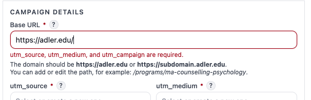
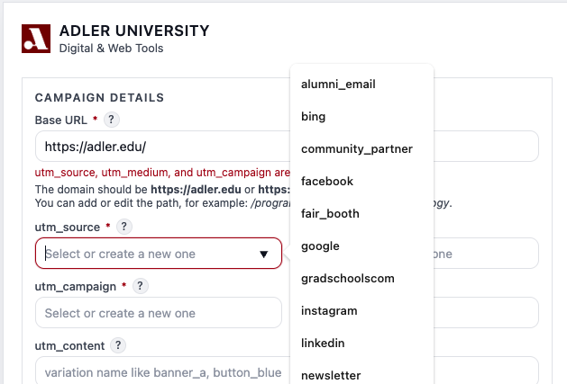
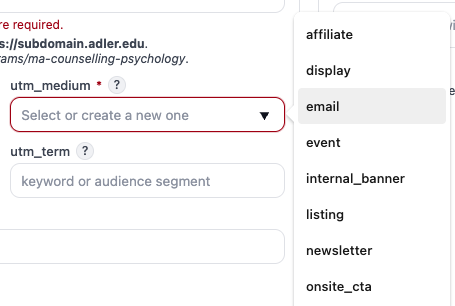
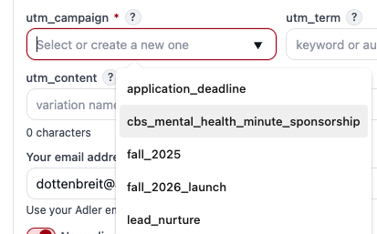
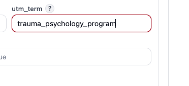
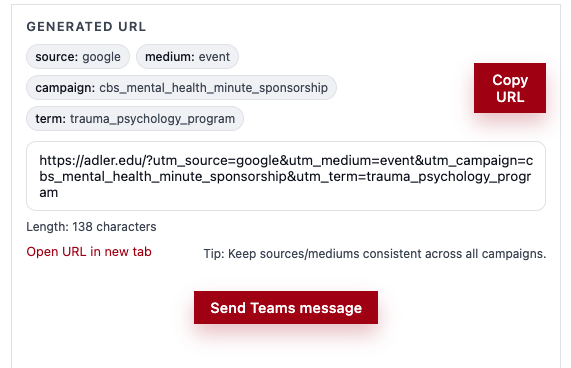

# Adler UTM Generator – How to Use

This guide explains how to create standardized, GA4-aligned tracking URLs using the Adler UTM Generator.

Tool URL:  
https://dottdesign.github.io/UTM-Generator/

---

## How UTMs Map to GA4

| UTM Parameter | GA4 Dimension Name        | Purpose |
|--------------|---------------------------|--------|
| utm_source   | Session source            | Where traffic originates |
| utm_medium   | Session medium            | How traffic arrives |
| utm_campaign | Session campaign          | Why the link exists |
| utm_content  | Session manual ad content | Differentiates links |
| utm_term     | Session manual term       | Paid search keyword |

---

## Step 1. Enter the Base URL

Paste the full webpage URL you want to track.

Example: https://www.adler.edu/programs/ma-psychology/

**Best practices**
- Always include `https://`
- Use the final destination page, not a redirect

---

## Step 2. Choose Your UTM Source

Identifies **where** the traffic comes from.

### Standard Adler Sources

| Channel Type | Value |
|-------------|-------|
| Google Ads | google |
| Facebook | facebook |
| Instagram | instagram |
| LinkedIn | linkedin |
| Email | email |
| QR Code | qr |
| Organic Social | organic-social |

---

## Step 3. Choose Your UTM Medium

Describes **how** the traffic arrives.

### Standard Adler Mediums

| Use Case | Value |
|--------|------|
| Email campaigns | email |
| Paid social | paid-social |
| Organic social | social |
| Paid search | cpc |
| Display ads | display |
| QR codes | offline |

---

## Step 4. Set the Campaign Name

Identifies **why** the link exists.

### Campaign Naming Formula
initiative_term_year

### Real Adler Examples
- `fall_2026_applications`
- `spring_2026_open_house`
- `faculty_research_webinar`
- `chicago_clinic_awareness`

---

## Step 5. Optional Fields

Use these only when additional detail is required.

### UTM Content
Maps to **GA4: Session manual ad content**

Used to differentiate multiple links pointing to the same URL.

| Placement Example | Value |
|------------------|------|
| Hero CTA button | hero_cta |
| Footer link | footer_link |
| Inline text link | inline_text |
| Image banner | image_banner |

### UTM Term
Maps to **GA4: Session manual term**

Primarily used for paid search keywords.

Example: trauma_psychology_program

---

## Step 6. Copy the Generated URL

The tool automatically builds the tracking URL.

Example output:
https://www.adler.edu/programs/ma-psychology/
?utm_source=facebook
&utm_medium=paid-social
&utm_campaign=fall_2026_applications
&utm_content=hero_cta

---

## Step 7. Use the URL

Paste the generated link into:
- Emails
- Paid ads
- Social posts
- QR codes
- Digital signage

Always use the **full generated URL** so GA4 tracking works correctly.

---

## Adler UTM Naming Standards

| Rule | Requirement |
|----|------------|
| Case | Lowercase only |
| Spacing | Use underscores, never spaces |
| Characters | Letters, numbers, underscores only |
| Consistency | Same values across teams |
| Internal Links | Never use UTMs internally |

---

## Common Mistakes to Avoid

- Changing naming conventions mid-campaign
- Using spaces or special characters
- Using UTMs on internal site links
- Mixing paid and organic mediums
- Editing URLs after generation

---

## /docs Folder Structure

Add screenshots to the repository using the following structure:

/docs
step-1-base-url.png
step-2-source.png
step-3-medium.png
step-4-campaign.png
step-5-optional-fields.png
step-6-generated-url.png

Screenshots should clearly highlight the active field using boxes or callouts.

---

## Need Help?

If you are unsure which values to use:
- Reference this README
- Review GA4 campaign reports
- Contact webmaster@adler.edu before publishing
